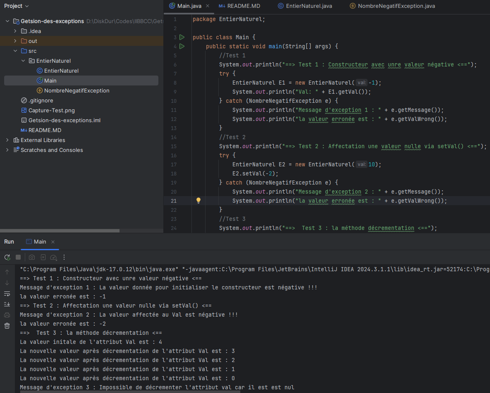
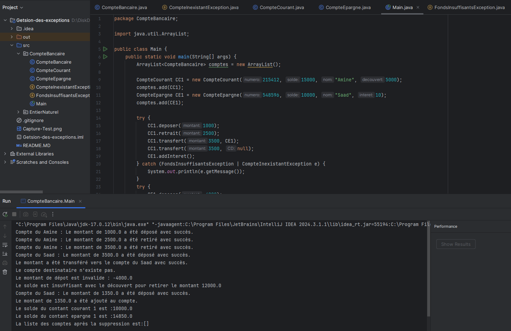

<h2>Getsion des exceptions</h2>
<h3>Une classe EntierNaturel permettant de gérer des entiers naturels</h3>
<h4>résultat de test ci-dessous</h4>

<h3>Gestion des comptes bancaires</h3>
<h4>résultat de test ci-dessous</h4>

